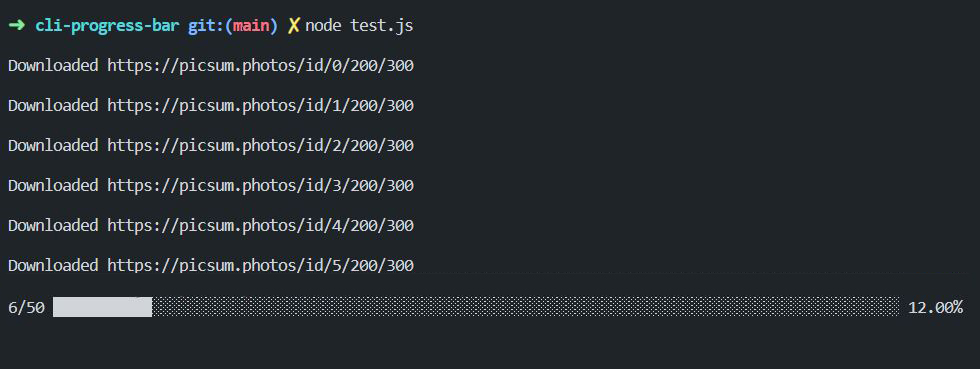

# Node.js CLI progress bar

<p align="center">
  
</p>

## Usage

```js
const ProgressBar = require('./index.js')

const size = 100
const bar = new ProgressBar(size)

bar.start()

for (let i = 0; i < size; i++) {
  // ...
  bar.update()
}

bar.stop()
```
